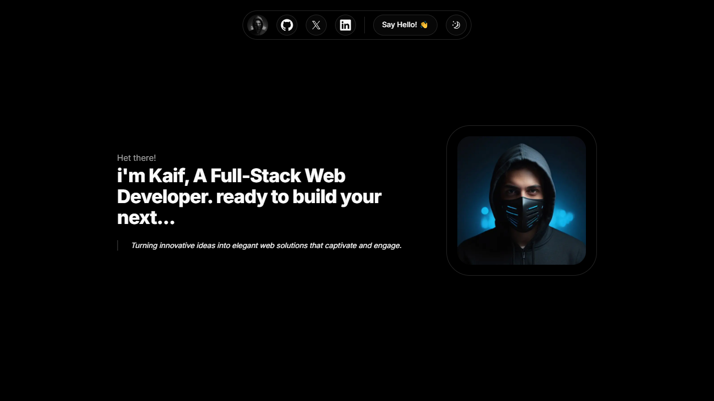
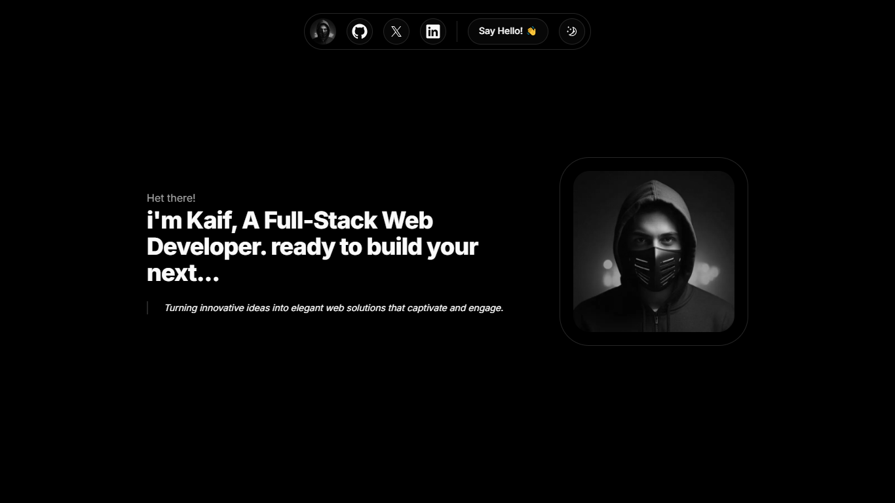

# Kaif's Portfolio

<div style="display: flex; justify-content: space-between;">
  
  
</div>

## Overview

This portfolio is built with a focus on simplicity and minimalism, highlighting my approach to clean, user-centric design. Utilizing cutting-edge technologies like Next.js for fast and scalable web development, Tailwind CSS for sleek and responsive layouts, and ShadCN UI for consistent, accessible components.

## Technologies Used

- **Next.js**: A powerful React framework for building server-side rendered and static websites.
- **Tailwind CSS**: A utility-first CSS framework for rapid UI development.
- **ShadCN UI**: A collection of accessible and customizable UI components for modern web apps.
- **Open Graph**: Meta tags for better social media integration and link previews.
- **Vercel Analytics**: Integrated analytics to monitor traffic and user behavior on the site.
- **Vercel**: Deployed and hosted on Vercel for fast and reliable performance.

---

## Getting Started

Follow these steps to run the project locally.

### 1. Clone the Repository

```bash
git clone https://github.com/MuhammadKaifNazeer/simple-portfolio.git
```

### 2. Navigate into the project directory

```bash
cd your-portfolio-repo
```

### 3. Install Dependencies

```bash
npm install
```

### 4. Run the Development Server

```bash
npm run dev
```